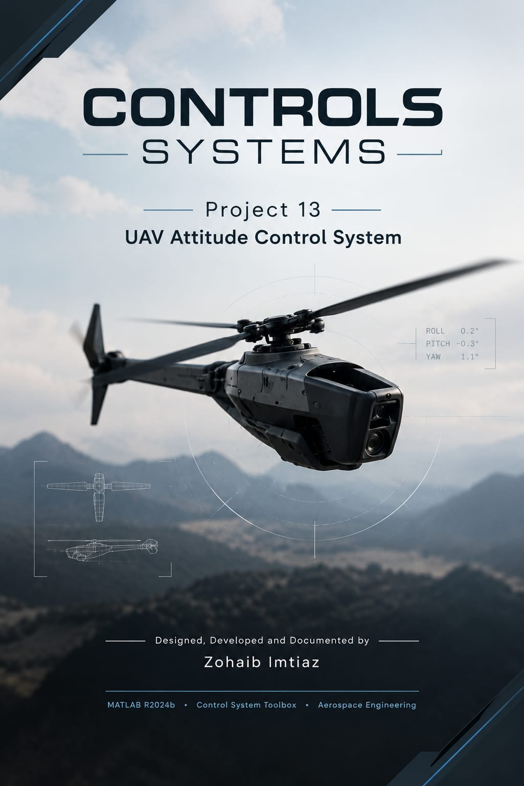
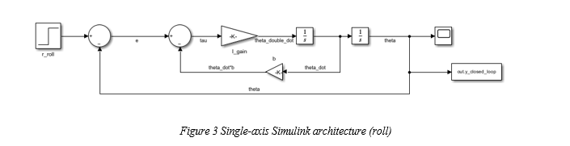
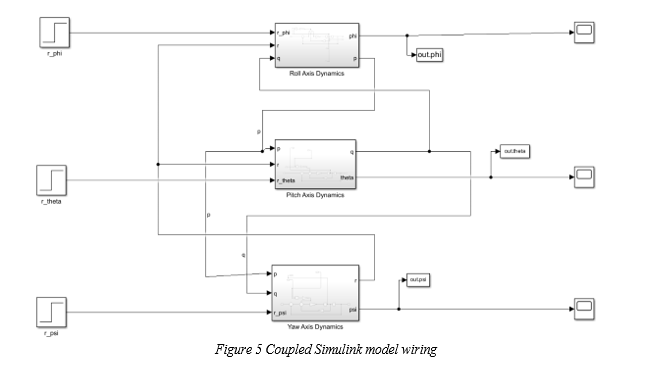
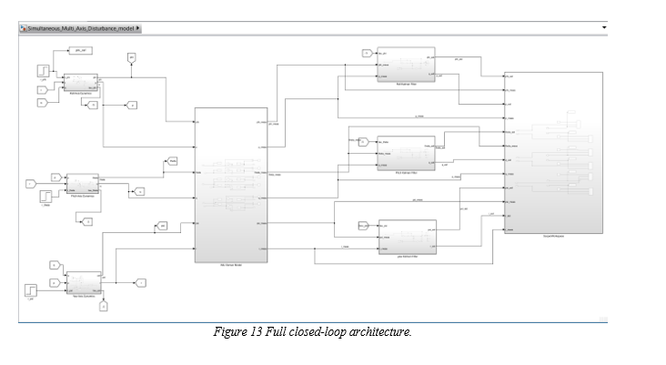

# UAV Attitude Control System — Coupled Dynamics, Sensor-Realistic State Estimation, and Disturbance Rejection

Continues from → [Project 12: Kalman Filter Design & State Estimation](https://github.com/Zohaibcoder/control-systems-project-12)

**Aerospace Control Implementation | Coupled Rigid-Body Dynamics | Kalman Estimation | Disturbance Rejection | Operating Envelope Analysis | Simscape Multibody + SolidWorks | Simulink | Aerospace Engineering**

This repository contains my thirteenth control systems project — the first that moves beyond isolated MATLAB analyses (Projects 01–12) into a complete, closed-loop, simulation-based flight control study. Where Projects 01–12 each investigated a single control-theory tool in isolation, Project 13 builds a full UAV attitude-control architecture in Simulink — plant, coupling, sensors, estimator, and controller — pressure-tests it until it reveals exactly where it works and where it doesn't, and finally visualizes the result on a real CAD geometry via Simscape Multibody.

---

## Engineering Question

> "Can a set of independently-designed, single-axis P-controllers and Kalman filters — each individually optimal — hold up once the vehicle's three rotational axes are physically coupled, its sensors are noisy, and it's hit by external disturbances? And if not everywhere, precisely where does it break, and why?"

**Answer:** Two of the three axes (roll, yaw) remain stable and within acceptable performance across the entire tested envelope — 5° to 180° commanded attitude, 1×–64× disturbance severity, with or without coupling. The third axis (pitch) is measurably degraded from the smallest angle tested onward, and the specific, traceable cause is identified: an under-filtered rate estimate that, combined with pitch's structural sensitivity to coupling, produces persistent chatter at small-to-moderate stress and genuine divergence only when pushed into a large-angle regime that also exceeds the underlying model's validity.

---

## Overview

Project 13 uses the **Black Hornet Nano** (mass = 33 g, rotor diameter = 12 cm, fuselage length = 10 cm) as a physically grounded example vehicle. The investigation proceeds in eight phases, each building directly on the last, followed by a 3D physical visualization of the final result:

1. **Single-axis foundations** — derive per-axis inertia, build the rotational plant, tune damping via a theory-predicted, simulation-verified critical-damping sweep
2. **Axis coupling** — quantify Euler cross-coupling analytically, then verify it in a fully cross-wired Simulink model
3. **Sensor modeling & Kalman estimation** — build a realistic noisy IMU model, then design, tune, and validate three independent Kalman filters
4. **Closed-loop estimate feedback** — replace true-state feedback with the actual sensor→filter→controller pipeline
5. **Disturbance rejection** — inject external torque disturbances, compare true-state vs. estimate-feedback rejection, and sweep severity
6. **Performance evaluation** — define acceptance criteria and establish the architecture's operating envelope
7. **Stress testing** — push attitude magnitude and disturbance severity to their combined extremes to find the true stability boundary
8. **CAD-linked 3D visualization** — import a SolidWorks assembly of the vehicle into Simscape Multibody and animate it directly from the Phase 6 simulation data

Every phase follows the same discipline used throughout the portfolio: **predict analytically, then verify in simulation** — and every major numerical prediction in this project (critical damping values, coupling-torque ratios, sensor-noise standard deviations) was confirmed by simulation to within a few percent before being trusted.

---

## Vehicle Parameters

| Parameter | Value |
|---|---|
| Vehicle class | Black Hornet Nano (coaxial nano-helicopter) |
| Mass | 33 g (0.033 kg) |
| Rotor diameter | 12 cm (0.12 m) |
| Fuselage length | 10 cm (0.10 m) |
| Roll inertia (I_xx) | 5.94×10⁻⁵ kg·m² (solid-cylinder approximation) |
| Pitch inertia (I_yy) | 2.76×10⁻⁵ kg·m² (thin-rod approximation) |
| Yaw inertia (I_zz) | 8.70×10⁻⁵ kg·m² (perpendicular axis theorem) |

---

## Phase 3 — Single-Axis Foundations

**Vehicle inertia**, derived from first-principles geometric approximations, was used to build each axis as a rotational mass-damper (`I·θ̈ + b·θ̇ = τ`) under unity-feedback P-control, with damping found via a theory-predicted critical-damping sweep (`b_critical = 2√(I·k)`), confirmed by simulation to within ~1% error on every axis:

| Axis | b_critical (theory) | b_critical (simulated) | Rise Time |
|---|---|---|---|
| Roll | 0.0154 | 0.0154 | 0.026 s |
| Pitch | 0.0105 | 0.0105 | 0.018 s (fastest) |
| Yaw | 0.0187 | 0.01865 | 0.038 s (slowest) |

**Finding:** the plant's free integrator already guarantees zero steady-state error, and critical damping eliminates overshoot — plain P-control is sufficient on all three axes; no PID was required.

---

## Phase 4 — Axis Coupling

Rigid-body rotational dynamics are inherently coupled through Euler's equations — cross-terms like `(I_j − I_k)·q·r` link each axis's acceleration to the *product* of the other two axes' rates. This was quantified analytically at 5°, 10°, and 57.3°, then verified in a fully cross-wired Simulink model.

| Step size | Roll coupling (% of control torque) | Pitch | Yaw |
|---|---|---|---|
| 5° | 0.83% | 0.26% | 0.60% |
| 10° | 1.65% | 0.53% | 1.19% |
| 57.3° (1 rad) | 9.48% | 3.03% | 6.83% |

**Key result:** simultaneous 3-axis commands at 57.3° produced far more overshoot on pitch (0.338%) than on roll or yaw (~0.003%), despite pitch's estimated coupling *fraction* being the smallest of the three. This was resolved by examining coupling-coefficient **sign**: roll's coefficient is negative (acts as extra damping), while pitch's and yaw's are positive (accelerating) — and pitch, having the smallest inertia and highest control bandwidth, has the least margin to absorb an accelerating disturbance without overshoot.

---

## Phase 5 — Sensor Modeling & Kalman Estimation

**Sensor model:** built from MPU-9250 datasheet noise specifications (a representative small-MEMS IMU), producing theoretical noise levels that matched simulated RMSE within a few percent. A key finding: **angle measurements are 25–50× noisier relative to signal than rate measurements** for this vehicle, a direct consequence of its unusually large peak angular rates.

**Kalman filters:** three independent steady-state discrete filters were built directly in Simulink (not as offline scripts, since Phase 4 onward requires them running live in the control loop). Each was tuned via a systematic Q-sweep, revealing a clean, physically-explained pattern:

| Axis | Rate-filter improvement | Raw rate SNR |
|---|---|---|
| Yaw | **+13.4%** (best) | Worst of the three — most room to improve |
| Roll | +11.7% | Moderate |
| Pitch | **~0%** (essentially unfiltered, K≈1) | Best of the three — least room to improve |

This ranking — yaw best, pitch essentially unfiltered — turns out to predict every subsequent finding in the project.

---

## Phase 6 — Closed-Loop Estimate Feedback & Disturbance Rejection

Feedback was rerouted from true state to Kalman-estimated state for all three axes simultaneously — the realistic architecture a real flight computer would actually have.

**Disturbance rejection** (a calibrated torque pulse, ~15–20% of each axis's own control torque):

| Axis | Peak deviation growth (true → estimate feedback) | Recovery |
|---|---|---|
| Roll | 4.03% → 6.63% | Recovers cleanly, 65 ms |
| Yaw | 0.18% → 1.20% | Recovers cleanly, 10 ms (fastest of any test) |
| Pitch | 0.10% → 1.60% (16× larger transient) | **Never fully settles — persistent 2.49% RMS chatter** |

**Severity sweep (1×–8× baseline disturbance):** the three-axis ranking held with striking consistency — yaw stayed "settles cleanly" throughout; roll degraded gracefully, crossing into "unstable chatter" only at 8×; pitch was already degraded at 1× and crossed into "unstable" by 4×.

**Simultaneous multi-axis disturbance on the coupled model** — the capstone numerical test of this phase, and the same test later visualized in 3D (see below) — showed pitch's vulnerabilities compound *multiplicatively*, not additively: at 10° with a modest disturbance, pitch's chatter (15.83%) already exceeded its 8×-severity result in isolation. Roll and yaw remained excellent (sub-1% chatter) under the same combined stress even at 57.3°.

---

## Phase 7 — Performance Evaluation & Operating Envelope

An acceptance-criteria framework (overshoot, RMS chatter, and boundedness thresholds) was applied across nominal and stressed conditions. **Removing the disturbance barely changed pitch's degradation** — coupling, not disturbance, is the dominant driver of pitch's performance failure within the disturbance levels tested in this phase. No acceptable pitch operating point was identified within the tested simultaneous-maneuver range of 5°–57.3°, while roll and yaw remained acceptable throughout.

---

## Phase 8 — Stress Testing to the Failure Boundary

A combined two-dimensional sweep — **8 commanded angles (5°–180°) × 7 disturbance severities (1×–64×)**, 56 total conditions — was run to distinguish "unacceptable but bounded" from genuine divergence.

**Result:** pitch remained bounded (degraded, not unstable) across every severity level from 5° through 120°, and diverged at exactly 180° regardless of disturbance severity — indicating attitude magnitude, not disturbance severity, is the variable most associated with pitch's transition to genuine instability. (180° lies outside the small-angle validity of the underlying model, so this is reported as a simulation-domain finding, not a claimed physical failure angle.) Roll diverged in exactly one corner of the grid — 5° combined with 64× disturbance. **Yaw never failed anywhere in the entire test grid.**

---

## CAD-Linked 3D Visualization — Simscape Multibody + SolidWorks

As a final step beyond the numerical analysis, the vehicle geometry was modeled in **SolidWorks** (fuselage, coaxial rotor, tail boom, and sensor housing, assembled with defined mates) and imported into **Simscape Multibody** using the SolidWorks-to-Simscape link, replacing the abstract rotational-mass-damper plant with a real, physically-rendered rigid body driven by the same attitude dynamics developed in Phases 3–6.

The resulting model, `Simultaneous_Multi_Axis_Disturbance_model`, plays back the exact Phase 6E scenario — simultaneous roll/pitch/yaw commands with a synchronized disturbance pulse — as true 3D motion in Simscape's Mechanics Explorer, viewable from multiple angles simultaneously. This closes the loop between the project's numerical findings and a physically interpretable animation of the same vehicle behavior.

https://github.com/user-attachments/assets/c9720682-b75f-4527-94af-a7bc3accc11d

---

## Key Engineering Conclusions

**1.** A control architecture's overall soundness and a specific component's tuning quality are separable findings. Roll and yaw demonstrate the P-control + coupled-dynamics + sensor + Kalman-filter architecture is fundamentally sound across a wide operating range. Pitch's limitation is precisely traceable to one filter's tuning, not a flaw in the architecture itself.

**2.** Disturbance rejection quality under estimate feedback tracks directly with each axis's Kalman filter rate-tuning quality (established in Phase 5) — not with axis bandwidth, inertia, or any other structural property.

**3.** Two distinct vulnerabilities — structural coupling sensitivity (Phase 4) and estimator tuning quality (Phase 5) — compound multiplicatively when they occur together (Phase 6), rather than simply adding.

**4.** "Stable but unacceptable" and "genuinely unstable" are different failure modes requiring different engineering responses. Across nearly the entire tested envelope, pitch's failure is the former (persistent, bounded chatter) — a precision problem, not a safety-of-flight problem.

**5.** The path forward is targeted, not a redesign: a coupling-aware (multi-axis or Extended) Kalman filter for pitch specifically, not a new controller architecture.

---

## Aerospace Applications

- **Realistic flight-control architecture:** demonstrates the complete estimator-plus-controller-plus-sensor loop that Projects 10–12 assumed but never built — the actual pipeline a real onboard flight computer runs.
- **Nano-UAV attitude control:** the Black Hornet-scale vehicle used here reflects a real, physically-motivated small-UAV control problem, including the disproportionately large angular rates that come with very low inertia.
- **CAD-in-the-loop verification:** the Simscape Multibody integration demonstrates a workflow directly transferable to verifying a real vehicle's CAD-derived inertial properties against its control system, rather than relying solely on hand-derived approximations.
- **Teknofest VLR Rocket:** the coupled-dynamics, sensor-model, disturbance-rejection, and CAD-visualization methodology developed here transfers directly to the rocket's attitude-control verification in Project 14.

---

---

## Software Used

- MATLAB R2024b
- Simulink
- Control System Toolbox
- Simscape Multibody
- SolidWorks (CAD assembly, imported via the Simscape Multibody Link add-in)

---

## Author

**Zohaib Imtiaz**
Aerospace Engineering Student | Flight Control

---

## License

This project is released under the MIT License.

---

## Project Cover

---

## Simulink Model Architecture

Three architecture diagrams represent the project's progressive build stages:

## Single axis Simulink Architecture

## Coupled Simulink Model

## Final Artitecture

---

